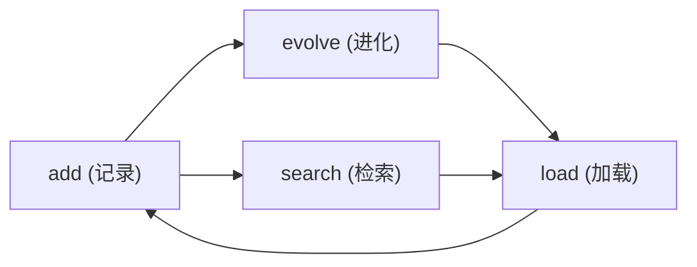

# Codex 记忆系统技能

跨会话持久记忆 — 从零散学习记录到结构化知识库的自动进化。

---

## 概述

本系统让 AI agent 拥有跨会话的持久记忆。核心工作流：



1. **记录** — `memory add` 写入零散学习记录，自动去重
2. **检索** — `memory search` 通过 FTS5 或向量语义查找
3. **进化** — `memory evolve` 将零散记录合成为结构化 `project-context.md`
4. **加载** — `memory load` 在会话启动时注入上下文

---

## 安装

本系统作为独立工具使用，不依赖外部服务。

```bash
# 1. 进入项目目录
cd codex-memory

# 2. 验证运行
python3 scripts/memory/main.py status

# （可选）添加别名
alias memory='python3 "\$(pwd)/scripts/memory/main.py"'
```

**依赖**：Python 3 (>=3.10) + SQLite（stdlib）。零额外安装。向量搜索需额外安装 `pip install sentence-transformers`。

---

## 命令参考

### `memory add` — 记录一条学习

```bash
memory add --type <类型> --content <内容> [--topics <标签>] [--no-evolve]
```

**参数**：
- `--type` (必填) — 记录类型：`preference` / `architecture` / `workflow` / `bug` / `tip`
- `--content` (必填) — 学习内容
- `--topics` (可选) — 标签，JSON 数组格式：`'["codex","AI"]'`
- `--no-evolve` (可选) — 跳过本次写入后的自动进化触发

**示例**：
```bash
# 记录一条工作流经验
memory add --type workflow --content "先写单测再写实现，单测要覆盖边界条件" --topics '["testing","best-practice"]'

# 记录一条偏好（用于自动沉淀到用户画像）
memory add --type preference --content "偏好 DeepSeek V4 Flash 作为主力模型" --topics '["model","preference"]'
```

**去重机制**：系统自动计算 SHA256(content + type + topics)，内容完全一致的记录不会重复插入。

---

### `memory search` — 搜索记忆

```bash
memory search <关键词> [--limit N] [--offset N]
```

搜索路径：FTS5 全文索引 → LIKE 兜底 → 向量检索（如果启用）。

**示例**：
```bash
memory search "并发"           # FTS5 搜索
memory search "单测" --limit 10  # 限制结果数
```

---

### `memory list` — 浏览所有记忆

```bash
memory list [--limit N]
```

按 `seq` 降序排列，显示最近的记录。

```bash
memory list
memory list --limit 20
```

---

### `memory delete` — 删除一条记忆

```bash
memory delete <seq>
```

软删除（标记 `deleted=1`）。如果该记录已被 evolve 合并过，自动递增 `correction_count`，下次 evolve 会从 `project-context.md` 中移除相关内容。

---

### `memory update` — 更新一条记忆

```bash
memory update <seq> [--content <新内容>] [--type <新类型>] [--topics <新标签>]
```

支持部分字段更新。如果更新已合并的记录，自动标记修正，下次 evolve 重新处理。

---

### `memory evolve` — 知识进化（核心）

```bash
memory evolve
```

将尚未合并和已修正的零散记录，全量合成为 `project-context.md`。

**进化内容**：
- 所有 `consolidated_seq IS NULL` 的新记录
- 所有 `correction_count > 0` 的被修正记录
- 被删除的已合并记录（在输出中标记已删除）

**版本管理**：
- 每次 evolve 在 `.backup/` 下生成 `v{N}.bak` 前置备份
- `project-context.md` 头部嵌入 `<!-- evolve_seq: N -->` 版本注释
- 如需回滚：手动从 `.backup/v{N}.bak` 恢复，然后运行 `memory evolve` 重新合并

**自动进化**：
当 `add` 操作的未合并记录数达到阈值（默认 20 条）时，`add` 命令会自动调用 `evolve`。可通过 `--no-evolve` 跳过自动触发：

```bash
# 大量导入时关闭自动 evolve，事后手动触发
memory add --type tip --content "..." --no-evolve
memory add --type tip --content "..." --no-evolve
memory add --type tip --content "..." --no-evolve
# 批量导入完成后手动进化
memory evolve
```

---

### `memory load` — 加载会话上下文

```bash
memory load [--limit N]
```

在每次会话启动时调用，输出：
1. `profile.md`（用户画像）
2. `project-context.md`（知识摘要）
3. 最近 N 条学习记录

会自动检测 `project-context.md` 是否过期（版本注释与 DB 不一致时告警）。

---

### `memory export` — 导出 Obsidian 兼容知识库

```bash
memory export [--dir <导出目录>]
```

为每条有效记录生成独立 `.md` 文件，格式：

```markdown
---
seq: 1
type: workflow
topics: ["testing"]
created: 2026-07-04
tags: [testing]
---

先写单测再写实现

---
*Source: memory.db | 导出: 2026-07-04*
```

导出的目录可直接作为 Obsidian vault 打开，或用任何 Markdown 阅读器浏览。

**仪表盘文件**：导出目录中自动生成 `_index.md`，包含导出时间、总记录数等元信息。

---

### `memory status` — 系统状态

```bash
memory status
```

输出健康仪表盘，包括：
- 总记录 / 有效 / 未合并 / 已删除
- 进化版本 / 历史版本数
- 累计统计：adds / corrections / evolves
- FTS5 和向量索引状态

---

### `memory config` — 配置系统

```bash
memory config [show|set-model] [--model <名称>]
```

- `show` — 显示当前配置和可用模型列表（当前选择的模型带 * 标记）
- `set-model --model <名称>` — 设置学习分析使用的模型

可用模型：
- `deepseek-v4-flash`（默认）— 快速、经济的推理
- `deepseek-v4-pro` — 高质量但稍慢
- `qwen3.7-plus` — 备选
- `glm-5.2` — 备选

---

### `memory review` — 学习分析（Codex 会话驱动）

```bash
memory review [list|mark] [--limit N] [--seq N]
```

- `list` — 输出未经过 LLM 处理的条目（JSON 格式），包含每条记录的 seq、type、content、correction_count，以及配置的 learner_model 名称
- `mark --seq N` — 将指定 seq 标记为 `llm_processed_at=now`

**使用场景**：Codex 会话开始时，agent 调用 `memory review list` 获取未处理条目，使用配置的 learner_model 进行分析，然后将分析结果写入 entities/beliefs 表，最后调用 `memory review mark` 标记已处理。

---

### `memory vec` — 向量索引管理

```bash
memory vec [status|enable|rebuild]
```

- `status` — 显示向量索引状态（可用/不可用，已索引数/总数）
- `enable` — 下载 BGE-small-zh-v1.5 嵌入模型，为所有有效记录计算 512 维向量并存入 `entries_vec` 表
- `rebuild` — 清空 `entries_vec`，重新为所有有效记录计算向量（用于添加新记录后同步索引）

**前置条件**：

```bash
pip install sentence-transformers
```

**使用流程**：

```bash
# 1. 安装依赖
pip install sentence-transformers

# 2. 启用索引（首次会自动下载模型，约 190MB）
memory vec enable

# 3. 验证
memory vec status

# 4. 添加新记录后重建索引
memory add --type tip --content "新知识"
memory vec rebuild
```
### `memory migrate` — 从旧系统导入

```bash
memory migrate
```

从 `~/.codex/memory/learnings.jsonl` 导入旧记录到 SQLite。

---

## 进化机制详解

### 自动进化流程

```
用户执行 memory add
  │
  ├──→ SHA256 去重检查
  │
  ├──→ INSERT + FTS5 同步
  │
  └──→ 检查 unmerged 记录数 ≥ 20 ?
         │
         ├── 是 → 同步调用 evolve()
         │        ├── acquire fcntl.flock(LOCK_EX)
         │        ├── 读取未合并 + 已修正记录
         │        ├── 前置备份 project-context.md → .backup/
         │        ├── 写入 project-context.md + 版本注释
         │        ├── DB 更新 consolidated_seq + correction_count=0
         │        └── release lock
         │
         └── 否 → add 完成
```

### 修正传导闭环

```
用户 update/delete 一条已合并记录
  │
  ├──→ correction_count += 1
  │
  └──→ 下次 evolve 自动捕获
         │
         ├── 已修正记录: 标记 `[user_correction]`
         ├── 已删除记录: 在输出中标记已移除
         └── 全量重写 project-context.md
```

### 并发安全

- SQLite WAL 模式支持一写多读
- `evolve` 全程持有 `fcntl.flock(LOCK_EX)`，阻止其他 session 同时 evolve
- `correction_count` 使用快照值 + 条件重置，防止并发写入丢失

---

## 配置

配置文件 `~/.codex/memory/config.toml`（可选）：

```toml
# 自动进化开关
auto_evolve_enabled = true

# 触发自动进化的未合并记录数阈值
auto_evolve_threshold = 10

# load 命令中提示进化的未合并记录数阈值
suggest_threshold = 10

# 学习分析使用的模型（首次配置后生效）
learner_model = "deepseek-v4-flash"  # 可选值见 memory config show
```

如不配置则使用默认值。

---

## 数据目录结构

```
~/.codex/memory/
├── memory.db           # SQLite 存储（WAL 模式）
├── config.toml         # 用户配置（可选）
├── profile.md          # 用户画像（可手动编辑）
├── project-context.md  # evolve 全量生成的结构化知识
├── .lock               # evolve 文件锁
├── .backup/            # evolve 前置备份
│   ├── v1.bak
│   └── v2.bak
├── export/             # export 输出目录
└── models/             # 嵌入模型（按需启用 vec 后创建）
```

---

## 最佳实践

1. **定期 evolve** — 建议 unmerged 数超过 20 时触发一次。自动进化默认开着，无需手动操心
2. **多用标签** — `--topics` 参数用有意义的标签，提升 FTS5 搜索精度
3. **profile.md 手动维护** — 用户画像文件可随时编辑，evolve 不会覆盖它
4. **大量写入时加 --no-evolve** — 批量导入数据时跳过自动触发，导完手动 evolve 一次
5. **善用 export** — 定期导出为 Obsidian vault，作为人类可读的知识备份
6. **vec 按需启用** — 默认数据量下 FTS5 已够用，语义检索只有大规模（>10K 条）时才开

---

## 故障排除

| 症状 | 原因 | 解决 |
|------|------|------|
| `unable to open database file` | `~/.codex/memory/` 目录不存在 | 运行一次 `memory status` 或 `mkdir -p ~/.codex/memory` |
| `database is locked` | 另一个进程正在 execute evolve | 等待几秒重试 |
| project-context.md 过期警告 | 有记录在 evolve 之后被修改 | 运行 `memory evolve` 更新 |
| 搜索结果为空但确信有数据 | FTS5 中文分词按单字匹配 | 尝试更少的关键词，或用 LIKE 兜底 |
